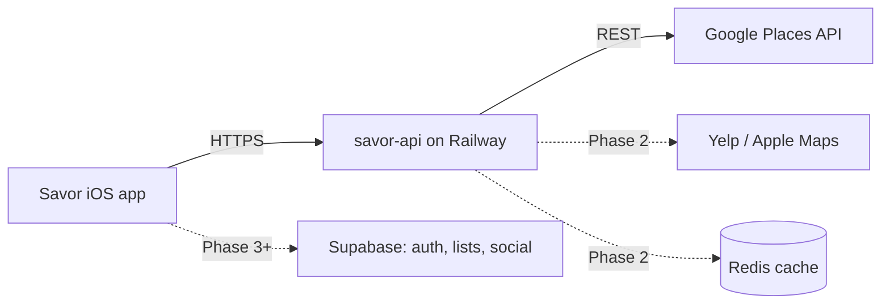
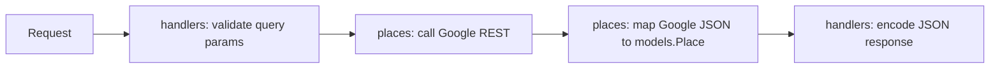

# savor-api — Architecture

A places intelligence layer. The iOS app never calls external place APIs directly;
this service owns all external place providers, caching, and response shaping.

## System context

## Request lifecycle (Phase 1 target)

Invariant: **Google response types never leave `internal/places`.** Handlers and
models only ever see our own `Place` struct.

## Code Map
<!-- Rule: every new file gets one line here, in the same change that creates it. -->

### cmd/server/
Entry point. Wires config → mux → server. No business logic.
- `main.go` — loads `.env` (godotenv), builds config, registers routes, starts `http.Server`

### internal/config/
Env-var config, loaded once at boot. Fails fast on missing required keys.
- `config.go` — `Load()` → `Config{Port, GooglePlacesAPIKey, Environment}`

### internal/handlers/
HTTP layer. Input validation happens here, before anything external is called.
- `health.go` — `GET /health`, static `{"status":"ok"}`

### internal/models/
Shared domain structs. The API's public vocabulary.
- `place.go` — `Place`: our provider-neutral place shape (ID, name, rating, price, types, coords, summaries, photo ref)

### internal/places/
Google Places REST client (Phase 1). Owns auth, HTTP calls, and Google→`models.Place` mapping.
- `client.go` — stub (package declaration only)

## Boundaries & principles
- Errors as values, idiomatic Go; stdlib `net/http` until routing needs justify chi
- All secrets via env vars; `.env` gitignored; TLS terminated by Railway
- Validate inputs before spending money on external API calls

## Roadmap position
Phase 1 (current): places proxy. See project roadmap for Phases 2–7.
