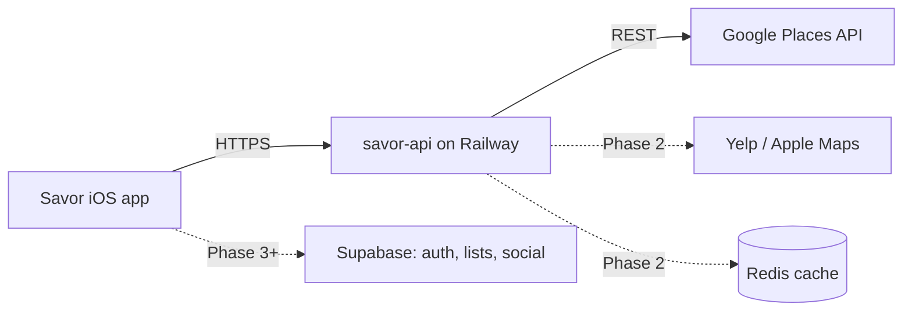
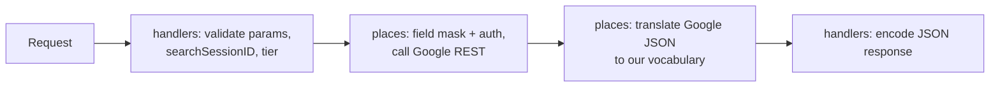

# savor-api — Architecture

A places intelligence layer. The iOS app never calls external place APIs directly;
this service owns all external place providers, caching, and response shaping.

## System context



## Phase 1 API surface

```
POST /places/autocomplete                      → {placeID, primaryText, fullText}[]
GET  /places/{id}?tier=save|enrich|coordinate  → models.Place (tier-scoped fields)
GET  /places/{id}/photos?max=3                 → {uri, widthPx, heightPx, attributions}[]
```

`tier` is intent-named on purpose: field masks and their billing consequences stay
server-side, and iOS never learns what a field mask is. `save` is the cheap on-add
tier, `enrich` the expensive on-demand tier, `coordinate` the backfill.

## Request lifecycle



Invariants:
- **Google response types never leave `internal/places`.** Handlers and models only
  ever see our own `Place` struct.
- **`internal/places` translates, it does not pass through.** Google's vocabulary
  (`"PRICE_LEVEL_MODERATE"`, photo names, enum strings) is converted to ours before
  crossing the package boundary — see decisions.md.
- **Session policy is server-side.** iOS mints `searchSessionID`; only `tier=save`
  forwards it to Google.
- **Validate before spending.** Malformed input is rejected before any billed call.

## Code Map
<!-- Rule: every new file gets one line here, in the same change that creates it. -->

### cmd/server/
Entry point. Wires config → mux → server. No business logic.
- `main.go` — loads `.env` (godotenv), builds config, registers routes, starts `http.Server` with read/write/idle timeouts

### internal/config/
Env-var config, loaded once at boot. Fails fast on missing required keys.
- `config.go` — `Load()` → `Config{Port, GooglePlacesAPIKey, Environment}`

### internal/handlers/
HTTP layer. Input validation happens here, before anything external is called.
- `health.go` — `GET /health`, static `{"status":"ok"}`
- `places.go` — `PlacesHandler` (holds `*places.Client`): autocomplete (UUID-validates
  `searchSessionID`, structured-logs it), details (tier parse, save-only token forward),
  photos (max 1–10, default 3). Upstream errors log real cause, return generic 502.

### internal/models/
Shared domain structs. The API's public vocabulary.
- `place.go` — `Place` (nullable-int `PriceLevel`, pointer `Coordinates`), `Suggestion`,
  `Photo` + `PhotoAttribution` — all JSON-tagged wire shapes

### internal/places/
Google Places (New) REST client (Phase 1). Owns auth, field masks, HTTP calls, and
Google→our-vocabulary translation. One file per endpoint, sharing an unexported `Client`.
- `client.go` — `Client` struct (apiKey, baseURL, `*http.Client`) + `New()`; base URL
  is a defaulted field so httptest can override it. `do()`: shared request/decode helper
  (auth + field mask as `X-Goog-*` headers, bounded error-body read).
- `autocomplete.go` — `Autocomplete()`: restaurant/cafe/bar/bakery filter (iOS parity),
  match offsets dropped, Google types unexported
- `details.go` — `Details()`: `Tier` type + `ParseTier`, tier→field-mask map,
  `translatePlace` (price-level enum → nullable int, unknown → nil)
- `photos.go` — `Photos()`: photos-mask details call, then per-photo media call with
  `skipHttpRedirect` → CDN URIs (800×600 max, iOS parity); one failed photo is skipped
- `testdata/` — real Google JSON captured by curl (autocomplete, details save/enrich
  tiers); Go tooling ignores `testdata/`, becomes httptest fixtures later

## Boundaries & principles
- Errors as values, idiomatic Go; stdlib `net/http` until routing needs justify chi
- All secrets via env vars; `.env` gitignored; TLS terminated by Railway
- Validate inputs before spending money on external API calls

## Roadmap position
Phase 1 (current): places proxy. See project roadmap for Phases 2–7.
